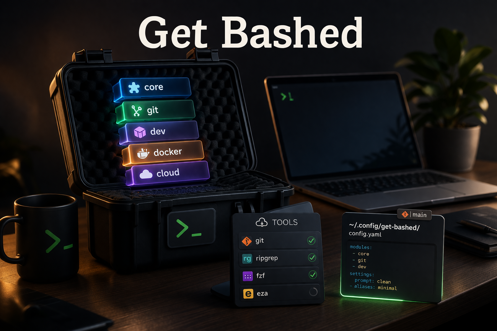

# get-bashed

<p align="center">
  
</p>

[](https://github.com/jbcom/get-bashed/actions/workflows/ci.yml)
[](https://github.com/jbcom/get-bashed/actions/workflows/cd.yml)
[](https://github.com/jbcom/get-bashed/releases)
[](LICENSE)

get-bashed is a modular Bash environment for macOS, Linux, and WSL. It installs a managed Bash profile under `~/.get-bashed`, wires shell startup predictably, and keeps installer choices reproducible through a generated config file. CI validates the repo on Ubuntu, macOS, and Ubuntu under WSL on `windows-2025`.
A dedicated `scorecard.yml` workflow tracks repository supply-chain posture separately from the Pages and release workflows, a repo-owned `codeql.yml` workflow carries advanced CodeQL scanning for `actions` and `python`, and every checked-in workflow now starts from explicit top-level `permissions: {}` before opting into narrower job-level scopes.

The public docs site is also the release installer surface: it hosts `/install.sh`, documents the published bundles, and tracks the generated Homebrew, Scoop, and Chocolatey manifests that are pushed into `jbcom/pkgs`.

## What it is

- Ordered `bashrc.d/` runtime modules loaded by `bashrc`.
- A generated config file, `get-bashedrc.sh`, that records feature choices.
- A centralized tool registry with dependency-aware installs.
- A managed install prefix that can be sourced or symlinked into `$HOME`.
- A Bash-first alternative to larger dotfile frameworks, aimed at workstation portability.

## What it is not

- A replacement for a general-purpose dotfile manager.
- A framework that auto-loads secrets or hidden providers at startup.
- A shell-agnostic project. This repo targets Bash, not zsh or fish.

## Quick start

```bash
curl -fsSL https://jbcom.github.io/get-bashed/install.sh | sh
```

That installer resolves the latest GitHub Release, downloads `get-bashed-<version>-unix.tar.gz`, verifies `checksums.txt`, extracts the bundled tree, and then execs the bundled `install.sh`.
It accepts either `--version v0.1.0` or `--version 0.1.0`.
Internally, the docs-site bootstrap supports either `curl` or `wget` for release downloads.
On Windows, use WSL, Scoop, Chocolatey, or the release bundle wrappers instead of piping the docs-site installer through Git Bash or MSYS shells.

If you are working from a checkout instead of a published release, the source-tree bootstrap remains:

```bash
sh install.sh
```

The source-tree bootstrap installs or locates Bash 4+ automatically before handing off to the full installer. When the repo-root `install.sh` is run as a standalone downloaded file, it fetches the repo tree pinned to that bootstrap revision before execing `install.bash`. On a fresh macOS machine without Homebrew, it bootstraps Homebrew from the repo-pinned installer first and then installs Bash through Homebrew.

To symlink shell dotfiles and set git identity:

```bash
sh install.sh --link-dotfiles --name "Jane Doe" --email "jane@example.com"
```

To install with the `dev` profile:

```bash
sh install.sh --profiles dev --link-dotfiles --name "Jane Doe" --email "jane@example.com"
```

## Profiles

Profiles set feature defaults and default installer bundles. CLI flags always win.

| Profile | Features | Use case |
|---|---|---|
| `minimal` | all off | Minimal Bash profile with no tool installs |
| `dev` | GNU tools, build flags, auto tools | Developer workstation |
| `ops` | dev + SSH agent + explicit Doppler support | Platform / ops workstation |

## Features

Enable or disable behaviors with `--features`. Prefix `no-` to disable.

| Feature | Description |
|---|---|
| `gnu_over_bsd` | Prefer GNU coreutils/sed/tar over BSD tools on macOS |
| `build_flags` | Export Homebrew build paths for local source builds |
| `auto_tools` | Run the optional pinned CLI bootstrap on shell startup |
| `ssh_agent` | Start and reuse `ssh-agent` |
| `doppler_env` | Enable explicit Doppler integration via `doppler_shell` |
| `bash_it` | Enable the bash-it framework if installed |
| `git_signing` | Install gnupg and wire git signing support |
| `dev_tools` | Bundle: rg, fd, bat, eza, fzf, jq, yq, tree, direnv, starship, nodejs, python, bash |
| `ops_tools` | Bundle: gh, git-lfs, terraform, awscli, kubectl, helm, stern, doppler, eza, nodejs, python, java, bash |

## Tool installer

Install any combination of tools from the registry:

```bash
sh install.sh --install brew,asdf,rg,fd,bat,fzf,jq
```

The registry prefers package managers, falls back to pinned git refs when needed, realigns managed git checkouts to the pinned refs on rerun, uses pinned pip/pipx package specs where those fallbacks are required, and uses a pinned, checksum-verified actionlint fallback download.
When `asdf` is used for `nodejs`, `python`, or `java`, the installer applies repo-pinned default versions from `installers/sources.sh` instead of resolving `latest` at install time.

Inspect without installing:

```bash
sh install.sh --list
sh install.sh --list-profiles
sh install.sh --list-features
sh install.sh --list-installers
sh install.sh --dry-run --install rg,fd,bat
```

## Releases and package managers

Published releases ship:

- `get-bashed-<version>-unix.tar.gz`
- `get-bashed-<version>-windows.zip`
- `checksums.txt`

Release packaging is driven by checked-in scripts:

- `scripts/build_release_artifact.sh`
- `scripts/smoke_test_release_artifact.sh`
- `scripts/release_validate.sh`
- `scripts/publish_draft_release.sh`
- `scripts/generate_pkg_manifests.sh`
- `scripts/verify_published_release.sh`
- `scripts/publish_pkg_pr.sh`

`release-please` is configured for draft-first releases with eager tag creation, so the tag exists before publication and GitHub can still compute the next changelog correctly.
`cd.yml` now creates the draft release, validates and attests the bundles, uploads the assets to the draft, publishes it, verifies the published surface, and then opens the `jbcom/pkgs` PR.
`release.yml` is the manual recovery path for rerunning that same checked-in release pipeline against an existing draft tag.
The docs installer latest-resolution path and the package-PR publication script are both exercised locally in the test suite rather than being left as GitHub-only assumptions.
When available, the release automation uses `CI_GITHUB_TOKEN` instead of the default workflow token so release-please PRs and release-side automation can trigger the rest of the repo’s GitHub Actions surface.

Package-manager install paths:

- `brew tap jbcom/pkgs && brew install get-bashed`
- `scoop bucket add jbcom https://github.com/jbcom/pkgs && scoop install get-bashed`
- `choco install get-bashed`

## Installer options

| Flag | Description |
|---|---|
| `--prefix PATH` | Install to PATH instead of `~/.get-bashed` |
| `--profiles NAMES` | Comma list of profiles to apply |
| `--features LIST` | Comma list of features (supports `no-` prefix) |
| `--install LIST` | Comma list of tools to install |
| `--link-dotfiles` | Symlink dotfiles from `$HOME` to `~/.get-bashed` |
| `--name NAME` | Set `user.name` in the managed gitconfig |
| `--email EMAIL` | Set `user.email` in the managed gitconfig |
| `--vimrc-mode MODE` | `awesome` (default) or `basic` vimrc flavor |
| `--with-ui` | Use curses dialog UI if `dialog` is available |
| `--auto` / `-a` | Disable prompts |
| `--yes` / `-y` | Auto-accept prompts |
| `--force` | Remove stale repo-managed assets while preserving unknown files |
| `--dry-run` | Print the resolved plan and installer dependency order without writing files |

## Runtime and secrets

Modules in `bashrc.d/` load in numeric order. Local secrets live in `~/.get-bashed/secrets.d/*.sh` and are sourced by `bashrc.d/99-secrets.sh`.

Doppler is explicit only: enabling `doppler_env` exposes `doppler_shell`, but startup never fetches or injects Doppler secrets automatically.

`auto_tools` remains opt-in. When enabled, `bashrc.d/65-tools.sh` only installs repo-pinned Node CLI package specs, checks the existing pinned npm package state first, and only runs if `asdf exec npm` is already available.

## Configuration

After install, `~/.get-bashed/get-bashedrc.sh` holds the resolved runtime config, including:

- `GET_BASHED_GNU`
- `GET_BASHED_BUILD_FLAGS`
- `GET_BASHED_AUTO_TOOLS`
- `GET_BASHED_SSH_AGENT`
- `GET_BASHED_USE_DOPPLER`
- `GET_BASHED_USE_BASH_IT`
- `GET_BASHED_GIT_SIGNING`
- `GET_BASHED_VIMRC_MODE`
- optional `GET_BASHED_USER_NAME`
- optional `GET_BASHED_USER_EMAIL`

See `docs/CONFIG.md` for the full contract.

## Local development

```bash
make lint
make test
make docs
make docs-check
make verify-security
make verify-immutable-release-governance
make package-release
make smoke-release
make release-validate
```

`make lint` uses the same bootstrap path as CI. `make test` bootstraps `bats`, fetches pinned BATS helpers, and runs install verification. `make docs` bootstraps both `shdoc` and `uv`, regenerates installer docs, validates the docs contract, and builds the Sphinx site. `make docs-check` adds Sphinx link checking so outbound docs links are exercised locally and in CI. `make verify-security` runs the checked-in supply-chain verifier across workflow pinning, explicit top-level workflow permission lockdown, pinned download sources, repo-owned CodeQL/Scorecard presence, draft-first release publication wiring, docs link validation wiring, immutable-release governance, and branch-protection verification availability. `make package-release`, `make smoke-release`, and `make release-validate` exercise the checked-in release pipeline locally, including the docs installer fallback downloader path.
The shared bootstrap disables Homebrew auto-update during these tool installs so local runs and CI stay deterministic.
`make verify-branch-protection` is the authenticated governance check for the live `main` branch policy; it verifies the exact required CI contexts plus the enforced review, code owner, and branch-safety settings instead of relying on stale prose about workflow files. Once `.github/workflows/codeql.yml` lands on `main`, it also expects `CodeQL (actions)` and `CodeQL (python)` to become required branch checks.
`make reconcile-codeql-governance` is the one-time post-merge cutover for that transition: it retires GitHub default CodeQL setup and patches the live required status-check list to include the repo-owned CodeQL jobs after `codeql.yml` is on `main`.
`make verify-immutable-release-governance` is the live check for the release side of that posture: it defers until the draft-first release flow lands on `main`, and after that it expects GitHub immutable releases to be enabled.
`make reconcile-immutable-release-governance` is the one-time post-merge cutover for that transition: it enables GitHub immutable releases after the checked-in draft-first release flow is present on `main`.
The repo also expects `.github/dependabot.yml` plus live GitHub automated security fixes, secret scanning, secret scanning push protection, validity checks, and non-provider secret patterns to stay enabled.

To refresh pinned `asdf` defaults after auditing newer runtime releases:

```bash
bin/gen_tool_versions
```

## Docs and security

Published docs are built by `cd.yml`, live under `docs/`, and expose the docs-site installer at `https://jbcom.github.io/get-bashed/install.sh`.

Security-sensitive surfaces include the bootstrap, installer helpers, PATH construction, and secrets handling. See `SECURITY.md` for the full policy.
